# LEMP Stack Server Setup Guides

To create a **LEMP stack** (Linux, Nginx, MySQL, PHP) setup on an AWS EC2 instance with **Ubuntu 24.04 LTS**, here are the steps:

## Prerequisites:
1. AWS account
2. SSH key pair for EC2 access
3. Terminal

### Step 1: Launch an EC2 Instance
1. **Sign in to AWS**, go to the **EC2 Dashboard**, and launch an instance with **Ubuntu 24.04 LTS**.
2. Choose **t2.micro** (free tier eligible), create or use an existing **Key Pair**, and configure **Security Groups** to allow SSH (port 22), HTTP (port 80), and HTTPS (port 443).
   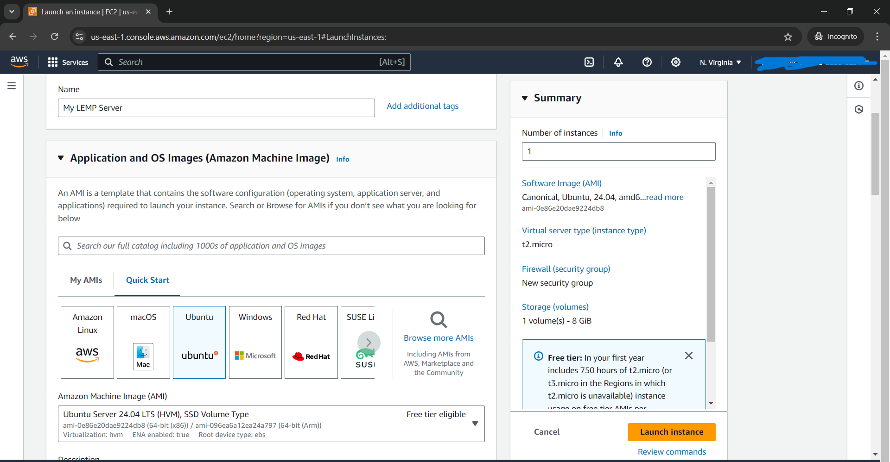
   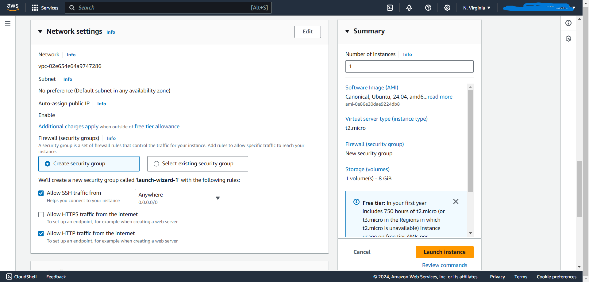

### Step 2: Connect to the EC2 Instance
Connect via SSH:
```bash
ssh -i your-key.pem ubuntu@<your-ec2-public-ip>
```
   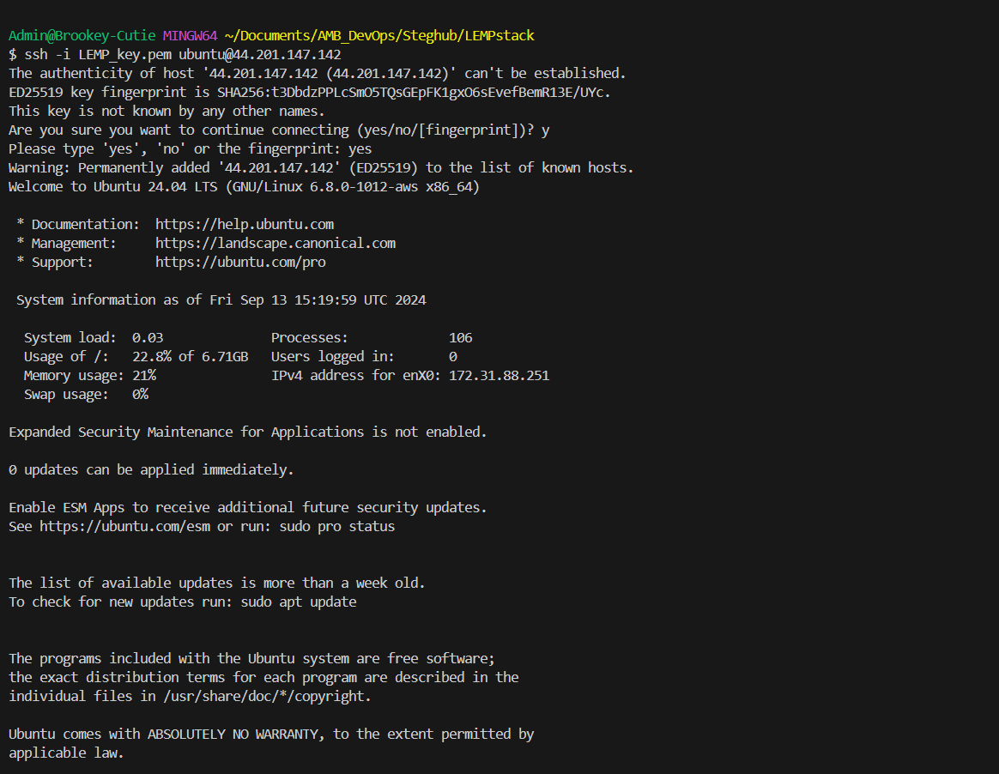

### Step 3: Update the Server
Run the following to update the package index and upgrade installed packages:
```bash
sudo apt update
sudo apt upgrade -y
```
   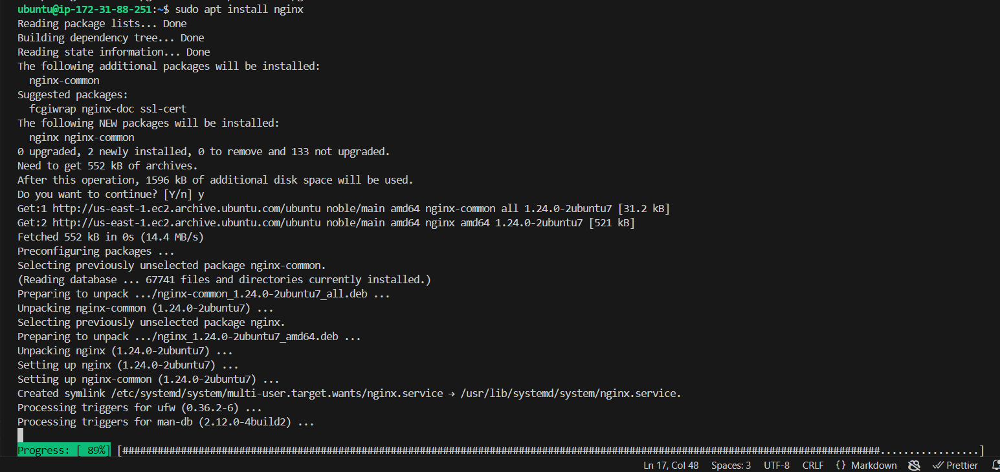

### Step 4: Install Nginx
1. Install **Nginx**:
   ```bash
   sudo apt install nginx -y
   ```
2. Start and enable Nginx:
   ```bash
   sudo systemctl enable nginx
   ```

3. Verify Nginx is running:
   ```bash
   sudo systemctl status nginx
   ```

4. Open your browser and navigate to your EC2 public IP to see the Nginx default welcome page or run:
   ```bash
   curl http://<ip-address>
   ```
   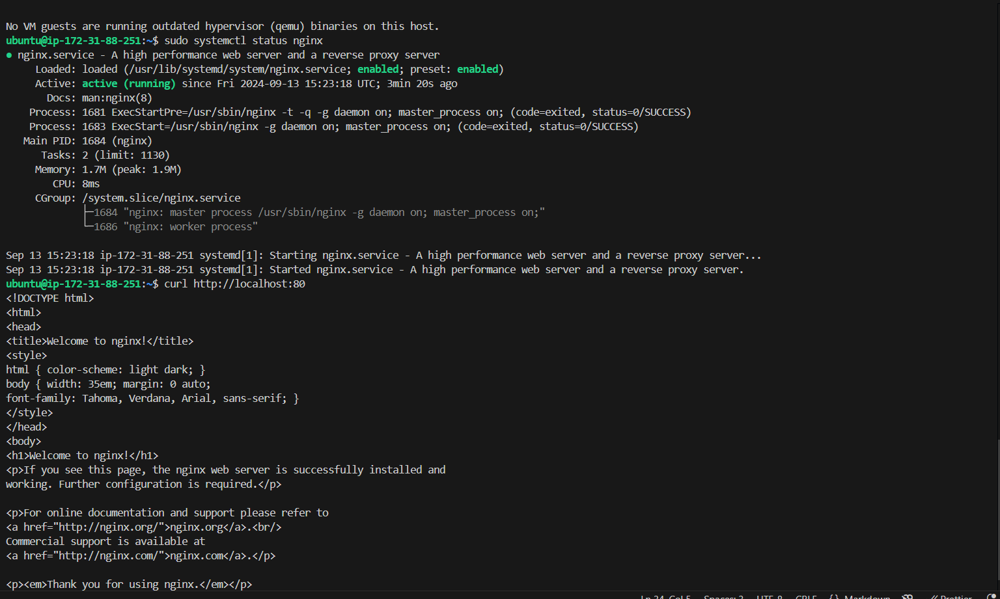
   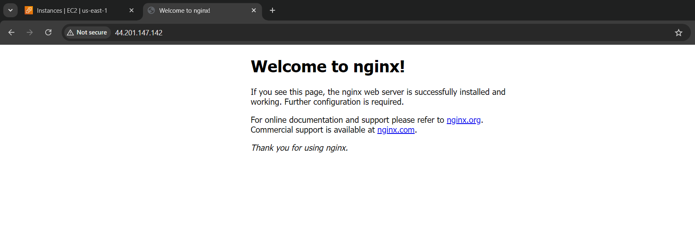 


### Step 5: Install MySQL
1. Install **MySQL**:
   ```bash
   sudo apt install mysql-server -y
   ```
  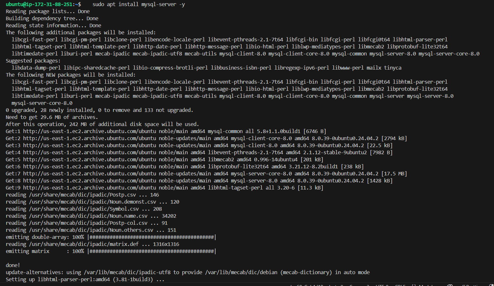

2. Log in to MySQL:
   ```bash
   sudo mysql
   ```
   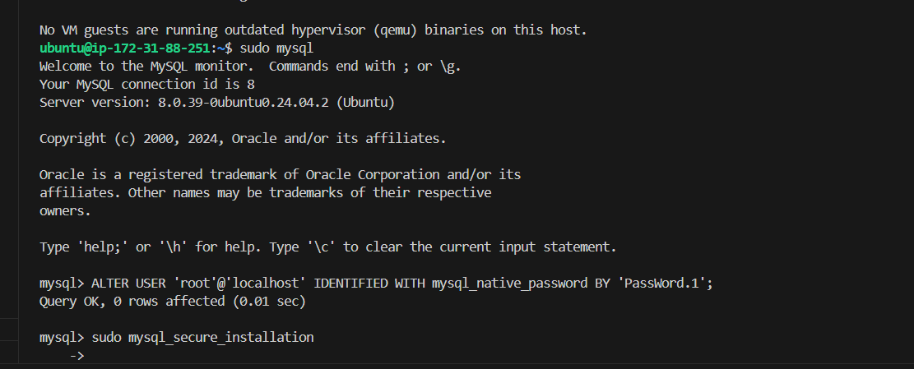

   Follow the prompts to set up the root password, remove anonymous users, disallow remote root login, and more.

   ```bash
   ALTER USER 'root'@'localhost' IDENTIFIED WITH mysql_native_password BY 'PassWord.1';
   ```

3. Secure MySQL installation:
   Exit the MySQL shell - type exit and press enter
   ```bash
   sudo mysql_secure_installation;
   ```
   Follow the prompts to secure the installation.
 

### Step 6: Install PHP
1. Install **PHP** and the required extensions for Nginx and MySQL:
   ```bash
   sudo apt install php-fpm php-mysql -y
   ```
   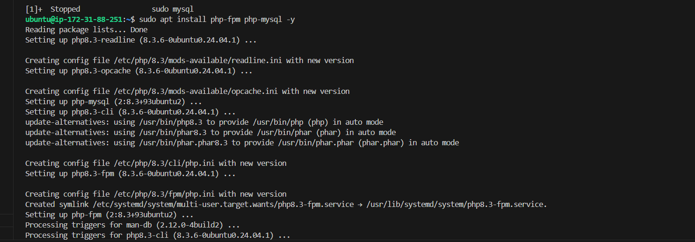
   
2. Check the PHP version:
   ```bash
   php -v
   ```
   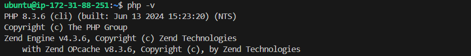


### Step 7: Configure Nginx to Use PHP Processor
1. Change the root web directory for your project:
   ```
   sudo mkdir /var/www/projectLEMP
   ```
      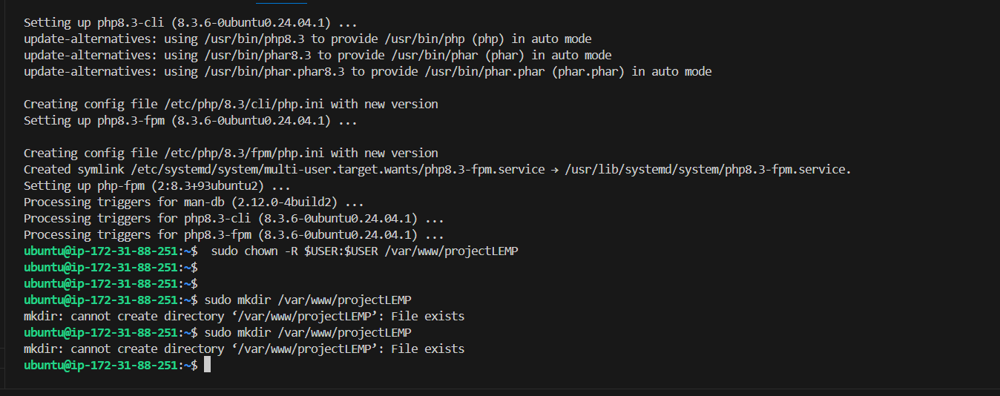

2. Open a new configuration file in NGINX sites-available directory:
   ```
    sudo nano /etc/nginx/sites-available/projectLEMP
   ```
   Paste this in:
   ```
   server {
       listen 80;
       server_name  projectLEMP www.projectLEMP;
       root /var/www/projectLEMP;

       index index.php index.html index.htm;


       location / {
           try_files $uri $uri/ =404;
       }

       location ~ \.php$ {
           include snippets/fastcgi-php.conf;
           fastcgi_pass unix:/var/run/php/php8.3-fpm.sock;
       }

       location ~ /\.ht {
           deny all;
       }
   }
   ```

3. Activate your configuration by linking to the config file.
   ```
   sudo ln -s /etc/nginx/sites-available/projectLEMP /etc/nginx/sites-enabled/
   ```
   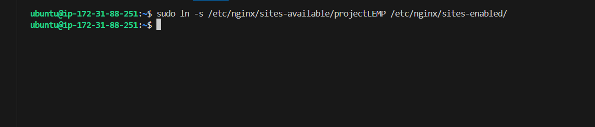

4. Test your configuration for syntax errors: 
   ```
   sudo nginx -t
   ```
   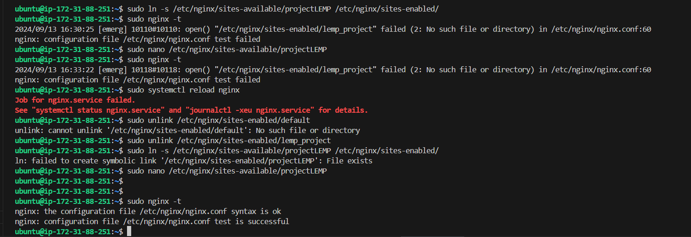

   **Note:** Check Errors 1. at the bottom of this solution to see how this was resolved.

5. Disable default NGINX host:   
   ```
   sudo unlink /etc/nginx/sites-enabled/default
   ```
6. Reload NGINX to apply changes:
   ```
   sudo systemctl reload nginx
   ```
   Go to your browser to view the changes.
   http://44.201.147.142/:80
   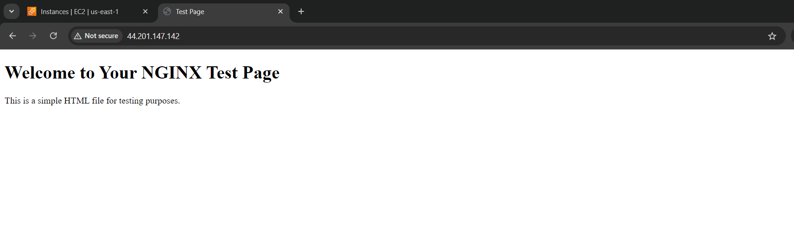

   **Note:** Check Errors 2. to see the original display and the resolution.


### Step 8: Test PHP
1. Create a PHP test file:
   ```bash
   sudo nano /var/www/projectLEMP/info.php
   ```
   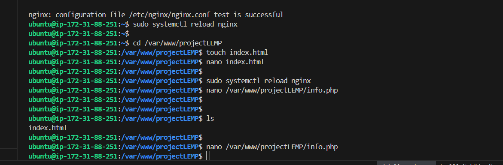

2. Add the following content to test PHP:
   ```php
   <?php
   phpinfo();
   ?>
   ```

3. Save and exit (`Ctrl+X`, `Y`, Enter`).

4. In your browser, visit `http://<your-ec2-public-ip>/info.php`. You should see a PHP info page.
   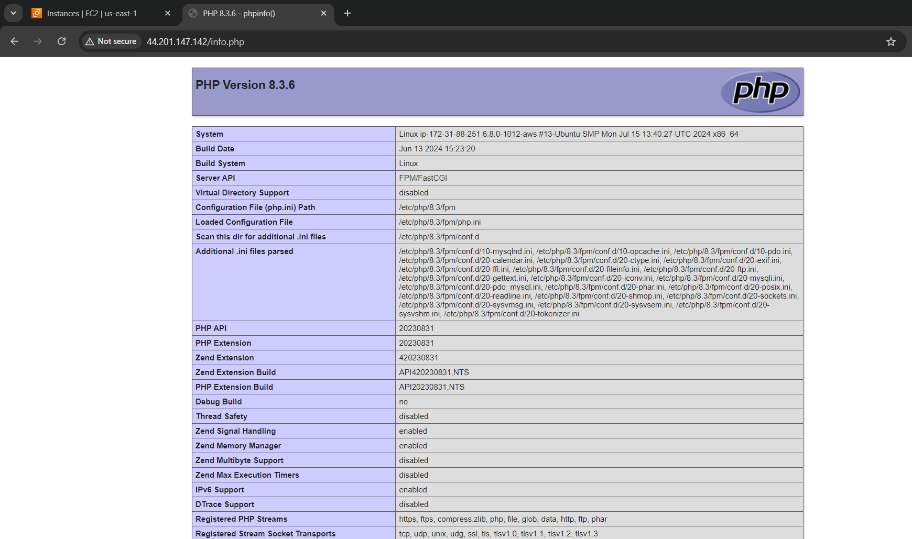
   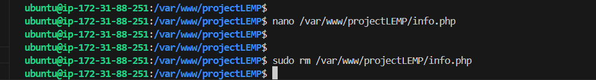


### Step 9: Retrieving MySQL Data from Database with PHP
1. Connect to the MySQL console using:
   ```bash
   sudo mysql -p
   ```

2. To create a new database:
   ```bash
   CREATE DATABASE `example_database`;
   ```

3. Create a new USER and grant permissions to use the DB:
   ```
   CREATE USER 'example_user'@'%' IDENTIFIED WITH mysql_native_password BY 'PassWord.1';
   ```
   Give this user permission to use the Database:
   ```
   GRANT ALL ON example_database.* TO 'example_user'@'%';
   ```

4. Test if the user has proper permissions by logging in the MySQL console:
   ```
   mysql -u example_user -p
   ```
   Show Databases:
   ```
   SHOW DATABASES;
   ```
   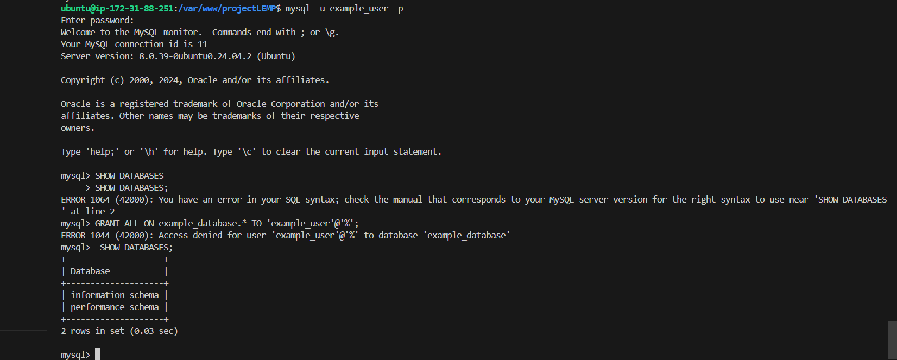

5. Create Table:
   ```
   USE example_database;
   ```
   ```
   CREATE TABLE todo_list (
      id INT AUTO_INCREMENT,
      task VARCHAR(255) NOT NULL,
      description TEXT,
      due_date DATE,
      completed BOOLEAN DEFAULT FALSE,
      PRIMARY KEY (id)
   );
   ```
6. Insert Data:
   ```
   INSERT INTO todo_list (task, description, due_date)
      VALUES
         ('Buy groceries', 'Milk, eggs, bread', '2024-09-20'),
         ('Finish project', 'Complete tasks for client', '2024-09-25'),
         ('Clean house', 'Vacuum, mop, dust', '2024-09-22'),
         ('Pay bills', 'Electricity, water, internet', '2024-09-15');
   ```
   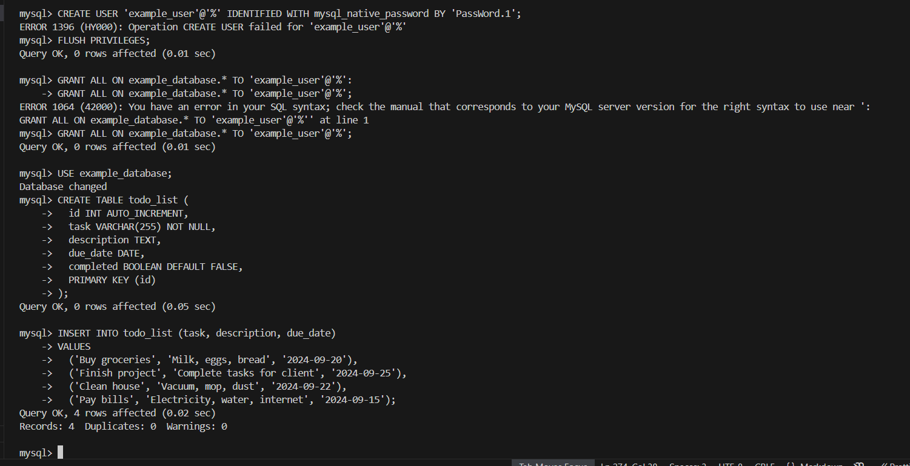

7. Verify Data:
   ```
   SELECT * FROM todo_list;
   ```
   This will display all the data in the todo_list table.

8. Create PHP Script that connects to the DB:
   ```
   nano /var/www/projectLEMP/todo_list.php   
   ```
   ```php
   <?php
      $user = "example_user";
      $password = "PassWord.1";
      $database = "example_database";
      $table = "todo_list";

      try {
          $db = new PDO("mysql:host=localhost; dbname=$database", $user, $password);
         $db->setAttribute(PDO::ATTR_ERRMODE, PDO::ERRMODE_EXCEPTION);

         echo "<h2>TODO</h2><OL>";

         foreach ($db->query("SELECT * FROM $table") as $row) {
            echo "<LI>";
            echo "<input type='checkbox' " . ($row['completed'] ? 'checked' : '') . ">";
            echo "<span>" . $row['task'] . "</span>";
            echo "<br>";
            echo "<small>" . $row['description'] . "</small>";
            echo "<small> Due: " . $row['due_date'] . "</small>";
            echo "</LI>";
          }

         echo "</OL>";
      } catch (PDOException $e) {
         echo "Error: " . $e->getMessage();
      }
      ?>
   ```
   Save and close the file.
   Now access your page on the browser:
   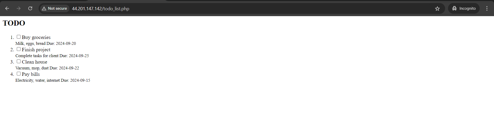


## Errors:
1.  Test your configuration for syntax errors: 
   ```
   sudo nginx -t
   ```
   

   ### Solutions:
   My project was linked to a lemp_project config file, all I did was unlink it, ensure I created the projectLEMP directory and its contents are in it. THen went on to link the projectLEMP directory and all worked well.
   ```
   sudo nginx -t
   ```
   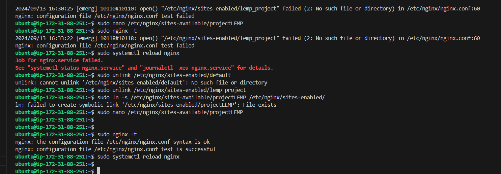

2. Showing Forbidden page on Browser
   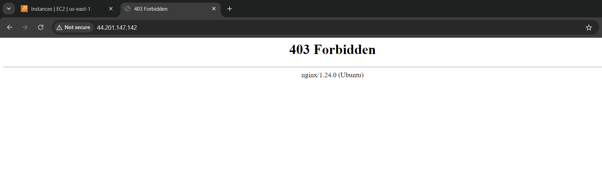


   ### Solution: I created an index.html file so the browser can have something to render.
   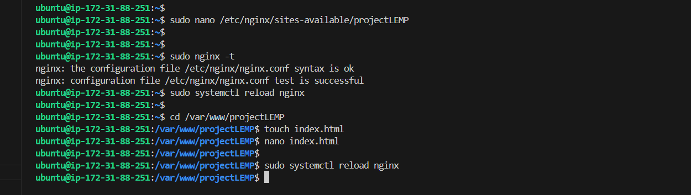


